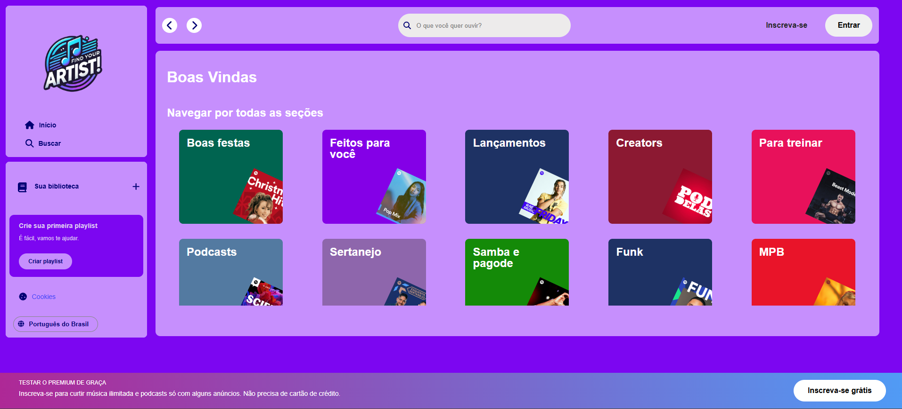
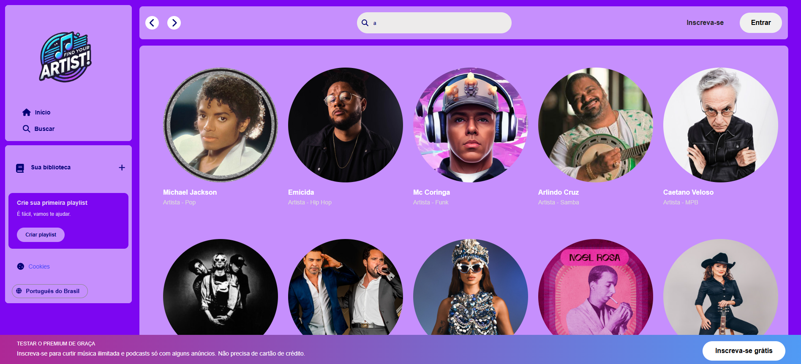

# Projeto de Portfólio - Inspirado no Spotify

Este é um projeto desenvolvido para o meu portfólio, com o objetivo de praticar o uso de linguagens de programação como HTML, CSS e JavaScript e sua integração dentro da biblioteca React.



## 🚀 Objetivo

O projeto tem como objetivo:

- Criar uma aplicação visualmente similar ao site do Spotify.
- Exibir o nome e a imagem de artistas populares.
- Redirecionar o usuário para a página do artista no Spotify.
- Utilizar a API do Spotify para buscar os dados dos artistas (nome, imagem, link).



## 🛠️ Tecnologias Usadas

- **[React](https://react.dev/)** - Biblioteca JavaScript para a criação de interfaces de usuário.
- **[Spotify for Developers](https://developer.spotify.com/)** - API oficial do Spotify, utilizada para obter informações sobre os artistas.
- **[CSS](https://www.w3schools.com/css/css_intro.asp)** - Para estilização da aplicação.

## 📦 Instalação

1. Instale o [Node.js](https://nodejs.org/pt) em sua máquina.
---
2. Clone este repositório para os seus arquivos por meio de um terminal (preferentemente pelo vscode ou cmd):
```bash
git clone https://github.com/ViniciusVChabariberi/spotify-copia/.git
```
---
3. Ative o servidor JSON localmente em seu terminal:
```bash
json-server --watch src/api/artists.json --port 3000
```
---
4. Inicie a aplicação pelo node:
```bash
npm start
```
---
5. Está pronta para ser utilizada!
<br>

## 🥳 Créditos

Gostaria de dedicar a criação deste repositório para a [Alura](https://www.alura.com.br/) em sua imersão Front-end 2025. Durante as aulas, pude absorver uma grande quantidade de conhecimentos e acompanhar perfeitamente os estudos pela boa didática dos instrutores.


